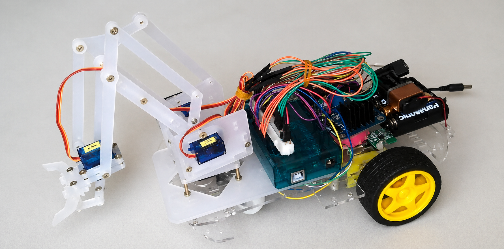
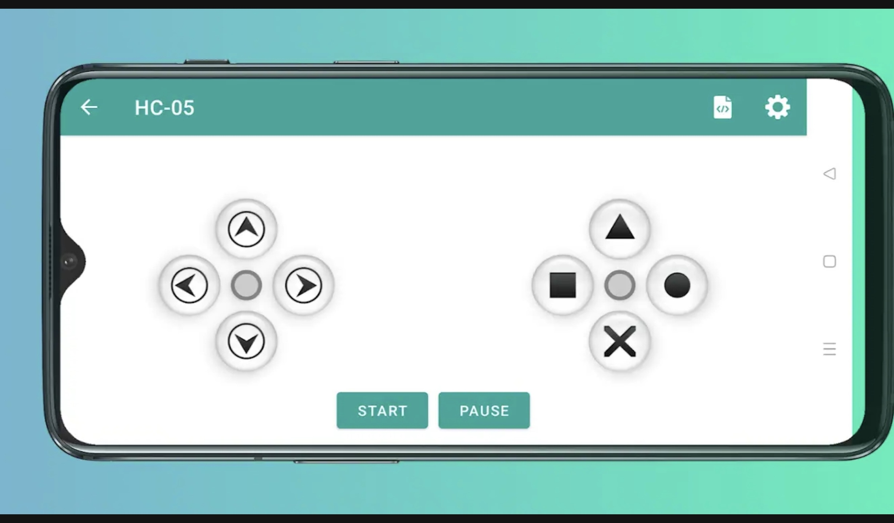

# Bluetooth Robotic Car with Mechanical Claw


Arduino project that combines a **robotic car** with a **mechanical claw**, controlled remotely via **Bluetooth** through a mobile app with a joystick interface.

---

## 📑 Table of Contents

- [Demo](#-demo)
- [Features](#-features)
- [How It Works](#-how-it-works)
- [Technologies](#-technologies)
- [Components Used](#-components-used)
- [Wiring Diagram (Pinout)](#-wiring-diagram-pinout)
- [Bluetooth Commands](#-bluetooth-commands)
- [Control App (Mobile Interface)](#-control-app-mobile-interface)
- [How to Run the Project](#-how-to-run-the-project)
- [Project Structure](#-project-structure)
- [License](#-license)

---

## 🖼️ Prototype



---

## ✨ Features

- 🚗 Move forward and backward
- ↩️ Turn left and right
- ⏹️ Stop the car
- 🦾 Open and close the robotic claw
- 📶 Real-time remote control via Bluetooth

---

## ⚙️ How It Works

The Arduino receives characters over serial communication (sent by the HC-05/HC-06 Bluetooth module) and, depending on the character received, drives **a single H-bridge** (using the 4 input pins IN1–IN4) to move the car's DC motors, or directly controls the servo motors responsible for the claw and the arm — with no H-bridge involved in that case.

The claw is controlled using pre-defined servo angles in the code: movements are smoothed by gradually incrementing the angle (with small delays) toward the saved target angle, instead of jumping straight to the final position.

---

## 🛠️ Technologies

- Arduino C/C++
- Arduino IDE
- `Servo.h` library
- HC-05 / HC-06 Bluetooth module
- Serial communication

---

## 🧩 Components Used

| Component | Function |
|---|---|
| Arduino Uno or Mega | Main controller |
| Acrylic robotic arm kit | Claw structure |
| H-bridge (1x) L298N or L293D | Controls the car's DC motors |
| 2x Servo motors | Moves the claw and the arm |
| HC-05/HC-06 Bluetooth module | Wireless communication with the phone |
| DC motors | Car traction |
| Robotic chassis | Car structure |
| 4x AA battery pack | Powers the Arduino board (~5-6V) |
| USB phone power bank | Powers the DC motors through the H-bridge |

---

## 🔌 Wiring Diagram (Pinout)

| Arduino Pin | Connected to | Description |
|---|---|---|
| 4 | H-bridge — IN1 | Left motor — rotation direction |
| 5 | H-bridge — IN2 | Left motor — rotation direction |
| 6 | H-bridge — IN3 | Right motor — rotation direction |
| 7 | H-bridge — IN4 | Right motor — rotation direction |
| 8 | Servo 2 (Arm) | Direct PWM signal for the arm servo |
| 9 | Servo 1 (Claw) | Direct PWM signal for the claw servo |
| RX/TX | Bluetooth module | Serial communication (9600 baud) |

> ⚠️ Pins 4, 5, 6, and 7 belong to a **single** H-bridge (IN1–IN4), responsible only for moving the car. The claw and the arm are controlled directly by the servo motors, with no H-bridge involved. Check your module's pinout (L298N/L293D) and adjust the wiring according to the model you're using.

> ⚠️ If the Arduino and the DC motors are powered by separate sources (e.g. an AA battery pack for the Arduino and a power bank for the motors), connect their **grounds (GND) together**. Without a common ground, the H-bridge won't receive a valid signal from the Arduino pins.

---

## 📡 Bluetooth Commands

Send the characters below through a Bluetooth joystick app to control the car:

| Command | Action |
|---|---|
| `G` | Move forward |
| `F` | Move backward |
| `R` | Turn left |
| `L` | Turn right |
| `S` | Stop |
| `8` | Close the claw |
| `7` | Open the claw |

---

## 📱 Control App (Mobile Interface)

The interface used to send commands is the **[HC-05 Bluetooth Arduino Control](https://play.google.com/store/apps/details?id=com.giristudio.hc05.bluetooth.arduino.control)** app, developed by **Giristudio** and available for free on the Google Play Store. The app is not part of this repository — it was used only as a remote control (joystick simulator), while all the logic for responding to commands was developed in this project.

Each button on the virtual joystick sends a character over Bluetooth (a simple serial protocol), which is captured by the Arduino and interpreted in the code's `loop()` to drive the car's motors or the claw's servo motors, according to the [commands table](#-bluetooth-commands) above.



---

## 🚀 How to Run the Project

1. Install the [Arduino IDE](https://www.arduino.cc/en/software).
2. Connect the Arduino board to your computer via USB.
3. Open the `bracoMecanicoComCarrinho.ino` file in the IDE.
4. Install/verify the `Servo.h` library (usually included with the IDE).
5. Select the correct board and port under **Tools**.
6. Upload the code to the Arduino.
7. Wire the circuit according to the [wiring diagram](#-wiring-diagram-pinout).
8. Pair the Bluetooth module (HC-05/HC-06) with your phone.
9. Install the [HC-05 Bluetooth Arduino Control](https://play.google.com/store/apps/details?id=com.giristudio.hc05.bluetooth.arduino.control) app (or another equivalent Bluetooth joystick app).
10. Connect the app to the HC-05 module and use the joystick buttons to send the characters from the commands table.
11. Control the car and the claw remotely! 🎮

---

## 📁 Project Structure

```
bluetooth-robotic-car-claw/
├── assets/
│   ├── archives/
│   │   └── README.md              # Previous version of the README (archived)
│   └── joystick-mobile-simulator.jpg
├── bracoMecanicoComCarrinho.ino   # Main source code (Arduino)
├── LICENSE                        # MIT License
└── README.md                      # Project documentation
```

---

## 📄 License

This project is licensed under the [MIT License](LICENSE).

---

<p align="center">Developed by <strong>Liane Heidemann</strong></p>
