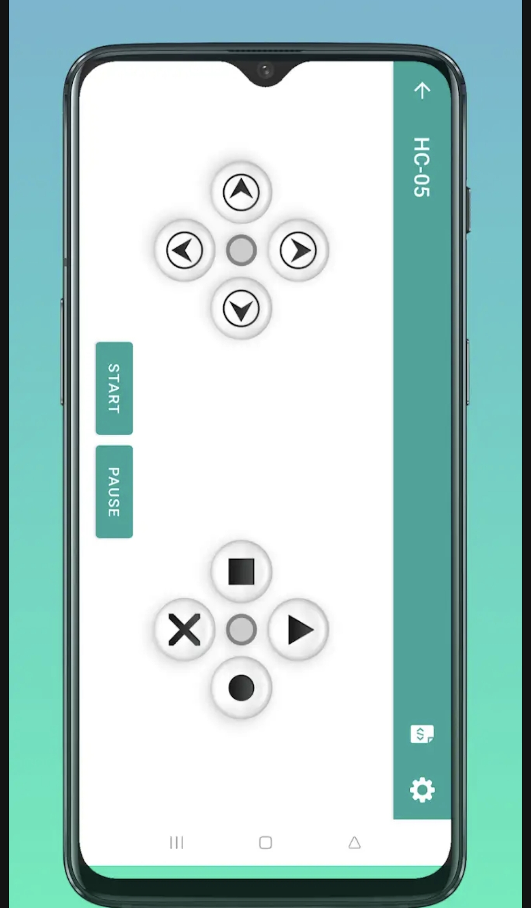

# Carrinho Robótico com Garra Mecânica via Bluetooth


Projeto em Arduino que combina um **carrinho robótico** com uma **garra mecânica**, controlados remotamente via **Bluetooth** através de um aplicativo de celular com interface de joystick.

---

## 📑 Sumário

- [Demonstração](#-demonstração)
- [Funcionalidades](#-funcionalidades)
- [Como funciona](#-como-funciona)
- [Tecnologias](#-tecnologias)
- [Componentes utilizados](#-componentes-utilizados)
- [Esquema de ligação (pinout)](#-esquema-de-ligação-pinout)
- [Comandos Bluetooth](#-comandos-bluetooth)
- [Aplicativo de controle (interface mobile)](#-aplicativo-de-controle-interface-mobile)
- [Como executar o projeto](#-como-executar-o-projeto)
- [Estrutura do projeto](#-estrutura-do-projeto)
- [Licença](#-licença)
- [Autora](#-autora)

---

## 🎥 Demonstração


---

## ✨ Funcionalidades

- 🚗 Mover para frente e para trás
- ↩️ Virar à esquerda e à direita
- ⏹️ Parar o carrinho
- 🦾 Abrir e fechar a garra robótica
- 📶 Controle remoto via Bluetooth em tempo real

---

## ⚙️ Como funciona

O Arduino recebe caracteres via comunicação serial (enviados pelo módulo Bluetooth HC-05/HC-06) e, de acordo com o caractere recebido, aciona **uma única ponte H** (usando os 4 pinos de entrada IN1–IN4) para movimentar os motores DC do carrinho, ou controla diretamente os servomotores responsáveis pela garra e pelo braço — sem nenhuma ponte H envolvida nesse caso.

O controle da garra é feito apenas por ângulos de servo pré-definidos no código: os movimentos são suavizados incrementando o ângulo gradualmente (com pequenos delays) até o ângulo alvo salvo, em vez de saltar diretamente para a posição final.

---

## 🛠️ Tecnologias

- Arduino C/C++
- Arduino IDE
- Biblioteca `Servo.h`
- Módulo Bluetooth HC-05 / HC-06
- Comunicação serial

---

## 🧩 Componentes utilizados

| Componente | Função |
|---|---|
| Arduino Uno ou Mega | Controlador principal |
| Kit de braço robótico acrílico | Estrutura da garra |
| Ponte H (1x) L298N ou L293D | Controle dos motores DC do carrinho |
| 2x Servo motores | Movimentação da garra e do braço |
| Módulo Bluetooth HC-05/HC-06 | Comunicação sem fio com o celular |
| Motores DC | Tração do carrinho |
| Chassi robótico | Estrutura do carrinho |
| Fonte de alimentação / bateria | Alimentação do circuito |

---

## 🔌 Esquema de ligação (pinout)

| Pino Arduino | Conectado a | Descrição |
|---|---|---|
| 4 | Ponte H — IN1 | Motor esquerdo — sentido de giro |
| 5 | Ponte H — IN2 | Motor esquerdo — sentido de giro |
| 6 | Ponte H — IN3 | Motor direito — sentido de giro |
| 7 | Ponte H — IN4 | Motor direito — sentido de giro |
| 8 | Servo 2 (Braço) | Sinal PWM direto do servo do braço |
| 9 | Servo 1 (Garra) | Sinal PWM direto do servo da garra |
| RX/TX | Módulo Bluetooth | Comunicação serial (9600 baud) |

> ⚠️ Os pinos 4, 5, 6 e 7 pertencem a **uma única** ponte H (IN1–IN4), responsável apenas pela movimentação do carrinho. A garra e o braço são controlados diretamente pelos servomotores, sem ponte H. Verifique a pinagem do seu módulo (L298N/L293D) e ajuste as ligações de acordo com o modelo utilizado.

---

## 📡 Comandos Bluetooth

Envie os caracteres abaixo através de um aplicativo de joystick Bluetooth para controlar o carrinho:

| Comando | Ação |
|---|---|
| `G` | Mover para frente |
| `F` | Mover para trás |
| `R` | Virar à esquerda |
| `L` | Virar à direita |
| `S` | Parar |
| `8` | Fechar a garra |
| `7` | Abrir a garra |

---

## 📱 Aplicativo de controle (interface mobile)

A interface usada para enviar os comandos é o app **[HC-05 Bluetooth Arduino Control](https://play.google.com/store/apps/details?id=com.giristudio.hc05.bluetooth.arduino.control)**, desenvolvido pela **Giristudio** e disponível gratuitamente na Google Play Store. O app não faz parte deste repositório — ele foi usado apenas como controle remoto (simulador de joystick), enquanto toda a lógica de resposta aos comandos foi desenvolvida neste projeto.

Cada botão do joystick virtual envia um caractere via Bluetooth (protocolo serial simples), que é capturado pelo Arduino e interpretado no `loop()` do código para acionar os motores do carrinho ou os servomotores da garra, conforme a [tabela de comandos](#-comandos-bluetooth) acima.



---

## 🚀 Como executar o projeto

1. Instale a [Arduino IDE](https://www.arduino.cc/en/software).
2. Conecte a placa Arduino ao computador via USB.
3. Abra o arquivo `bracoMecanicoComCarrinho.ino` na IDE.
4. Instale/verifique a biblioteca `Servo.h` (geralmente já vem com a IDE).
5. Selecione a placa e a porta correta em **Ferramentas**.
6. Faça o upload do código para o Arduino.
7. Monte o circuito conforme o [esquema de ligação](#-esquema-de-ligação-pinout).
8. Pareie o módulo Bluetooth (HC-05/HC-06) com o seu celular.
9. Instale o app [HC-05 Bluetooth Arduino Control](https://play.google.com/store/apps/details?id=com.giristudio.hc05.bluetooth.arduino.control) (ou outro app de joystick Bluetooth equivalente).
10. Conecte o app ao módulo HC-05 e use os botões do joystick para enviar os caracteres da tabela de comandos.
11. Controle o carrinho e a garra remotamente! 🎮

---

## 📁 Estrutura do projeto

```
bluetooth-robotic-car-claw/
├── archive/
│   └── README.md                  # Versão anterior do README (arquivada)
├── bracoMecanicoComCarrinho.ino   # Código-fonte principal (Arduino)
├── LICENSE                        # Licença MIT
└── README.md                      # Documentação do projeto
```

---


## 📄 Licença

Este projeto está sob a licença [MIT](LICENSE).

---

## 👩‍💻 Autora

**Liane Heidemann**
